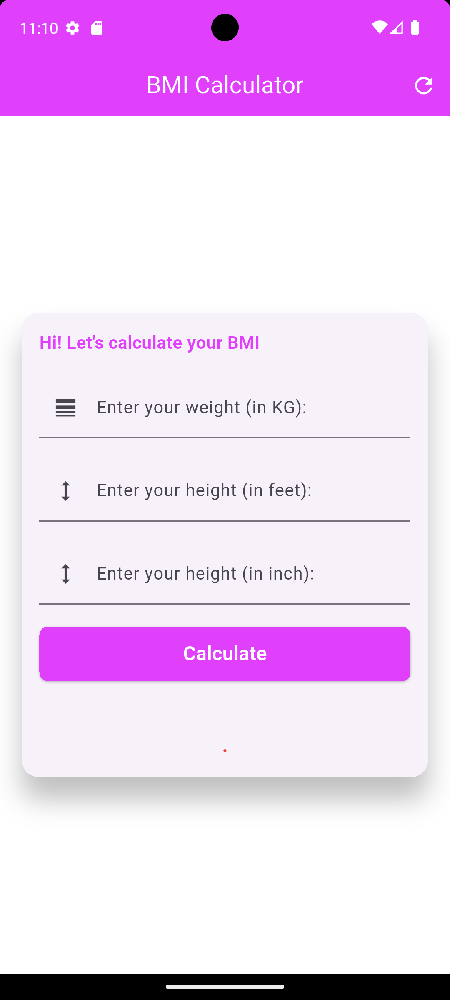
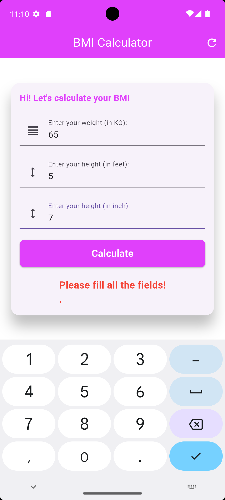
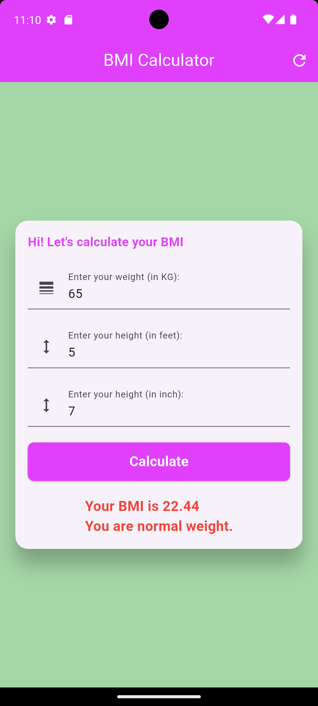
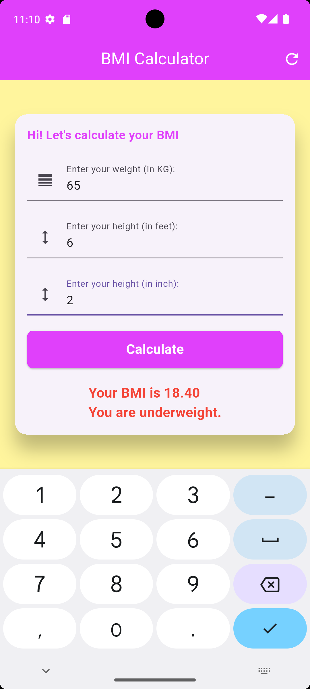
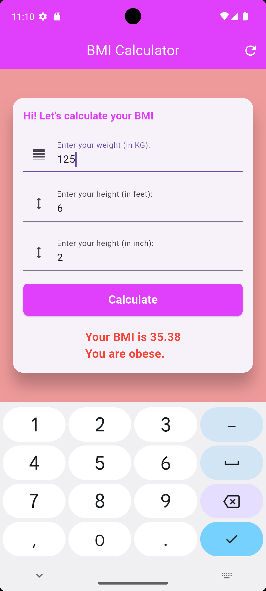
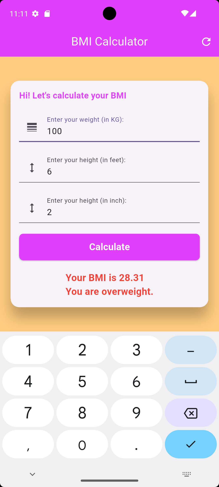

# BMI Calculator App 💪

A modern and responsive BMI (Body Mass Index) Calculator built with Flutter.  
This application helps users calculate BMI based on height and weight while providing health status feedback through a clean and user-friendly interface.

---

## 📱 Features

- 📏 Calculate BMI instantly
- 🎨 Clean and modern UI
- ⚡ Fast and responsive performance
- 📊 BMI category interpretation
- 📱 Cross-platform Flutter support
- 🔢 Real-time calculation results
- 🧮 User-friendly input fields

---

## 🖼️ Screenshots









---

## 🛠️ Tech Stack

- **Flutter**
- **Dart**
- **Material Design**

---

## 📂 Project Structure

```bash
lib/
│
├── main.dart
├── bmi.dart
```

---

## 🚀 Getting Started

### Prerequisites

Before running the project, make sure you have installed:

- Flutter SDK
- Dart SDK
- Android Studio / VS Code
- Emulator or Physical Device

---

## ⚙️ Installation

### 1️⃣ Clone the repository

```bash
git clone https://github.com/deXT-Sadman/bmi_calculator_app.git
```

### 2️⃣ Navigate to the project directory

```bash
cd bmi_calculator_app
```

### 3️⃣ Install dependencies

```bash
flutter pub get
```

### 4️⃣ Run the app

```bash
flutter run
```

---

## 📊 BMI Formula

The Body Mass Index is calculated using:

\[
BMI = \frac{weight (kg)}{height (m)^2}
\]

### Example

- Weight = 70 kg
- Height = 1.75 m

\[
BMI = 22.86
\]

---

## 🧠 BMI Categories

| BMI Range | Category |
|-----------|----------|
| Below 18.5 | Underweight |
| 18.5 - 24.9 | Normal Weight |
| 25 - 29.9 | Overweight |
| 30+ | Obese |

---

## 📦 Dependencies

Example dependencies used in this project:

```yaml
dependencies:
  flutter:
    sdk: flutter
flutter_lints: ^6.0.0
```

---

## 🎯 Learning Objectives

This project was built to practice and improve:

- Flutter UI Design
- Stateful Widgets
- User Input Handling
- Layout Building
- Responsive Design
- Navigation
- Dart Programming

---

## 🔥 Future Improvements

- Dark Mode Support
- BMI History Tracking
- Better UI Animations
- Health Recommendations
- Firebase Integration
- Multi-language Support

---

## 🤝 Contributing

Contributions are welcome!

### Steps to contribute:

1. Fork the repository
2. Create a new branch

```bash
git checkout -b feature-name
```

3. Commit your changes

```bash
git commit -m "Added new feature"
```

4. Push to your branch

```bash
git push origin feature-name
```

5. Open a Pull Request

---

## 📄 License

This project is licensed under the MIT License.

---

## 👨‍💻 Author

### Sadman Khan

- GitHub: https://github.com/deXT-Sadman

---

## ⭐ Show Your Support

If you like this project, please give it a ⭐ on GitHub!

---

## 🔗 Repository Link

https://github.com/deXT-Sadman/bmi_calculator_app